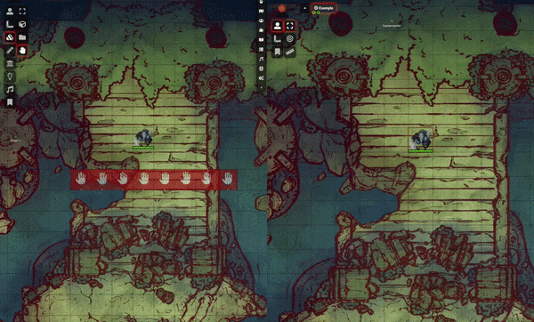
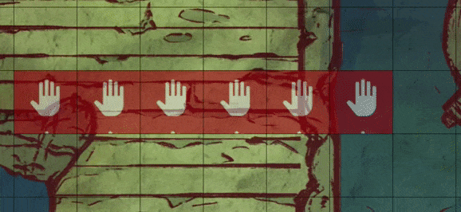

# Hey, Wait! :raised_hand:

“Hey, Wait!” is a FoundryVTT module allowing a GM to place “event triggers” as tiles on a scene. When players collide with these triggers, the game pauses and the scene shifts to the player, allowing a GM to explain the theatre-of-the-mind landscape, if the player has ran into a pack of monsters, or anything else you can think of! The intent is to give GMs a bit of breathing room with a pack of players who love to explore.

## What Does This Look Like? :eyes:

On the left, we see the GM's screen where they have placed a Hey, Wait! tile (shown in red.) On the right, we see the player's screen, where they are unable to see the tile. After a collision into the Hey, Wait! tile, the game pauses and pans over to the player who triggered the tile. When a tile is triggered, it turns green. Hey, Wait! also picks up if a player has dragged their token across the scene.

Thanks to [Neutral Party](https://www.patreon.com/neutralparty) for the sample background map above.

## Instructions :scroll:

Start by installing the module, and enabling it for your world. If you click on the Tile button in the toolbar, you'll see a new button added denoted by a :hand:. This is the same as the Tile creation tool, except it's used to create Hey, Wait! tiles. These tiles are hidden "triggers" which, when a player steps on them with the token they're moving, will trigger a game pause and pans all players' views over to them. You are still able to use the normal tile functionality in FoundryVTT.

You can also toggle the triggered state of the Hey, Wait! tile. Right-click on the tile and toggle it like so:

Note that the visibility button has disappeared. Hey, Wait! tiles are always invisible to players.

## Settings :ballot_box_with_check:

* **Restrict GM from Triggering Tiles:** If enabled, triggering of the Hey, Wait! tiles will be locked down to only player's token movement and not the GM

## Known Limitations :x:

* No rotation allowed on Hey, Wait! tiles
* Accessibility issues - red and green aren't the best colours to use here. Eventually we'd like to move to the Hey, Wait! tiles having some sort of pattern in them denoting the tile's triggered status

## Future Planned Features :crystal_ball:

* Animation on token when triggering tiles
* Sound effects when triggering tiles
* Accessibility improvements
* ...please suggest some!

## Acknowledgements :wave:

* Thanks to [Game-icons.net](https://game-icons.net) for the use of the ["Halt" icon](https://game-icons.net/1x1/skoll/halt.html), and the ["Confirmed" icon](https://game-icons.net/1x1/delapouite/confirmed.html``)
